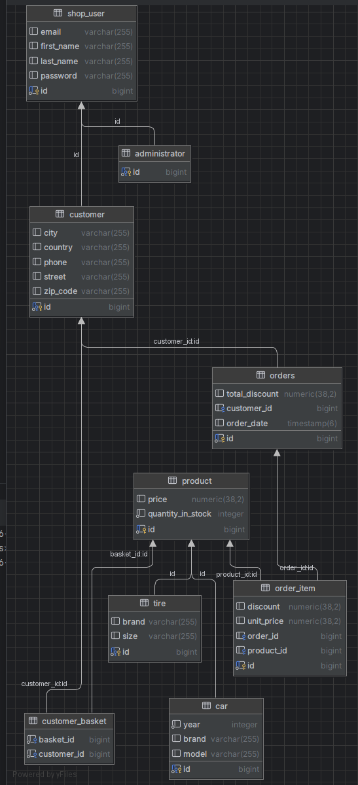

<style>
    .pic-container {
        display: flex;
        justify-content: center;
    }

    .desc {
        text-align: center;
    }
</style>

# Drive Wheels Deals

>Kacper Szot, Jakub Rękas, Tomasz Grzybacz

Projekt oparty jest o Spring Freamwork wraz z ORMem Hibernate. Użyta baza danych to PostgreSQL.
Tematem projektu jest oprogramowanie obsługujące sklep sprzedający samochody i opony.

<div class="pic-container">
    
</div>

<p class="desc"><b>Zdj. 1</b> - diagram bazy danych</p>


## Model
### User
```java
@Entity
@Inheritance(strategy = InheritanceType.JOINED)
@Table(name = "shop_user")
public class User implements UserDetails {
    @Id
    @GeneratedValue(strategy = GenerationType.SEQUENCE)
    private Long id;
    private String firstName;
    private String lastName;
    private String email;
    private String password;

    @OneToMany(mappedBy = "customer")
    private List<Order> orders;

    public User() {
    }

    public User(String firstName, String lastName, String email, String password) {
        this.firstName = firstName;
        this.lastName = lastName;
        this.email = email;
        this.password = password;
    }

    public List<Order> getOrders() {
        return orders;
    }

    public void setOrders(List<Order> orders) {
        this.orders = orders;
    }

    public Long getId() {
        return id;
    }

    public void setId(Long id) {
        this.id = id;
    }

    public String getFirstName() {
        return firstName;
    }

    public void setFirstName(String firstName) {
        this.firstName = firstName;
    }

    public String getLastName() {
        return lastName;
    }

    public void setLastName(String lastName) {
        this.lastName = lastName;
    }

    public String getEmail() {
        return email;
    }

    public void setEmail(String email) {
        this.email = email;
    }

    public void setPassword(String password) {
        this.password = password;
    }

    @Override
    public Collection<? extends GrantedAuthority> getAuthorities() {
        return null;
    }

    public String getPassword() {
        return password;
    }

    @Override
    public String getUsername() {
        return email;
    }

    @Override
    public boolean isAccountNonExpired() {
        return true;
    }

    @Override
    public boolean isAccountNonLocked() {
        return true;
    }

    @Override
    public boolean isCredentialsNonExpired() {
        return true;
    }

    @Override
    public boolean isEnabled() {
        return true;
    }
}
```
<p class="desc"><b>Kod 1</b> - klasa <code>User</code></p>

Klasa zawiera podstawowe informacje o użytkownikach wspólne dla klientów i administratorów:
- Imię
- Nazwisko
- Email
- Hasło

Pole `ID` jest kluczem głównym tabeli.

### Customer
```java
@Entity
public class Customer extends User {
    @Id
    @GeneratedValue(strategy = GenerationType.SEQUENCE)
    private Long id;
    private String phone;
    private String zipCode;
    private String city;
    private String street;
    private String country;
    @ManyToMany
    private List<Product> basket;


    public Customer() {
    }
    
    public Customer(String firstName, String lastName, String email, String password, String phone, String zipCode, String city, String street, String country) {
        super(firstName, lastName, email, password);
        this.phone = phone;
        this.zipCode = zipCode;
        this.city = city;
        this.street = street;
        this.country = country;
    }

    public List<Product> getBasket() {
        return basket;
    }

    public void setBasket(List<Product> basket) {
        this.basket = basket;
    }

    @Override
    public Long getId() {
        return id;
    }

    @Override
    public void setId(Long id) {
        this.id = id;
    }

    public String getPhone() {
        return phone;
    }

    public void setPhone(String phone) {
        this.phone = phone;
    }

    public String getZipCode() {
        return zipCode;
    }

    public void setZipCode(String zipCode) {
        this.zipCode = zipCode;
    }

    public String getCity() {
        return city;
    }

    public void setCity(String city) {
        this.city = city;
    }

    public String getStreet() {
        return street;
    }

    public void setStreet(String street) {
        this.street = street;
    }

    public String getCountry() {
        return country;
    }

    public void setCountry(String country) {
        this.country = country;
    }

}
```
<p class="desc"><b>Kod 2</b> - kod klasy <code>Customer</code></p>

Klasa dziedziczy z klasy `User`, zawiera informacje o klientach:
- Numer telefonu
- Kod pocztowy
- Ulica
- Miasto
- Kraj

Elementem klasy jest również lista, która zawiera informacje o produktach w koszyku użytknownika.

Kluczem głównym jest pole `ID`, które jest jednocześnie kluczem obcy do tabeli `User`
odnoszącym się do pola `ID`.

### Administrator
```java
@Entity
public class Administrator extends User {
    @Id
    @GeneratedValue(strategy = GenerationType.SEQUENCE)
    private Long id;

    public Administrator() {
    }

    public Administrator(String firstName, String lastName, String email, String password) {
        super(firstName, lastName, email, password);
    }

    @Override
    public Long getId() {
        return id;
    }

    @Override
    public void setId(Long id) {
        this.id = id;
    }
}
```
<p class="desc"><b>Kod 3</b> - kod klasy <code>Administrator</code></p>

Klasa dziedziczy z klasy `User`, zawiera informacje o użytkownikach, którzy są administratorami.

Kluczem głównym jest pole `ID`, które jest jednocześnie kluczem obcym do tabeli `User`.

### Product
```java
@Entity
@Inheritance(strategy = InheritanceType.JOINED)
public class Product {
    @Id
    @GeneratedValue(strategy = GenerationType.SEQUENCE)
    private Long id;
    private BigDecimal price;

    private int quantityInStock;

    public Product() {
    }

    public Product(BigDecimal price, int quantityInStock) {
        this.price = price;
        this.quantityInStock = quantityInStock;
    }

    public Long getId() {
        return id;
    }

    public void setId(Long id) {
        this.id = id;
    }

    public BigDecimal getPrice() {
        return price;
    }

    public void setPrice(BigDecimal price) {
        this.price = price;
    }

    public int getQuantityInStock() {
        return quantityInStock;
    }

    public void setQuantityInStock(int quantityInStock) {
        this.quantityInStock = quantityInStock;
    }
}
```
<p class="desc"><b>Kod 4</b> - kod klasy <code>Product</code></p>

Klasa `Product` zawiera podstawowe informacje o produktach - cenę oraz ilość w magazynie.

Kluczem głównym jest pole `ID`.

### Car
```java
@Entity
public class Car extends Product {
    @Id
    @GeneratedValue(strategy = GenerationType.SEQUENCE)
    private Long id;
    String brand;
    String model;
    int year;


    public Car(String brand, String model, int year, BigDecimal price,int quantityInStock) {
        super(price,quantityInStock);
        this.brand = brand;
        this.model = model;
        this.year = year;
    }
    public Car() {}

    @Override
    public Long getId() {
        return id;
    }

    @Override
    public void setId(Long id) {
        this.id = id;
    }

    public String getBrand() {
        return brand;
    }

    public void setBrand(String brand) {
        this.brand = brand;
    }

    public String getModel() {
        return model;
    }

    public void setModel(String model) {
        this.model = model;
    }

    public int getYear() {
        return year;
    }

    public void setYear(int year) {
        this.year = year;
    }
}
```
<p class="desc"><b>Kod 5</b> - kod klasy <code>Car</code></p>

Klasa zawiera informacje o samochodach:
- Marka
- Model
- Rok produkcji

Klasa dziedziczy z klasy `Product`

Kluczem głównym i obcym do klasy `Product` jest pole `ID`

### Tire
```java
@Entity
public class Tire extends Product {
    @Id
    @GeneratedValue(strategy = GenerationType.SEQUENCE)
    private Long id;
    String brand;
    String size;

    public Tire() {
    }

    public Tire(String brand, String size, BigDecimal price,int quantityInStock) {
        super(price, quantityInStock);
        this.brand = brand;
        this.size = size;
    }

    @Override
    public Long getId() {
        return id;
    }

    @Override
    public void setId(Long id) {
        this.id = id;
    }

    public String getBrand() {
        return brand;
    }

    public void setBrand(String brand) {
        this.brand = brand;
    }

    public String getSize() {
        return size;
    }

    public void setSize(String size) {
        this.size = size;
    }
}
```
<p class="desc"><b>Kod 6</b> - kod klasy <code>Tire</code></p>

Klasa zawiera informacje o oponach:
- Marka
- Rozmiar

Klasa dziedziczy z klasy `Product`. Pole `ID` jest kluczem głównym oraz kluczem obcym
do tabeli `Product`.

### Order
```java
@Entity
@Table(name = "orders")
public class Order {
    @Id
    @GeneratedValue(strategy = GenerationType.IDENTITY)
    private Long id;
    @ManyToOne
    private Customer customer;
    @OneToMany(mappedBy = "order")
    private List<OrderItem> items;
    private Timestamp orderDate;
    private BigDecimal totalDiscount;

    public Order() {
    }

    public List<OrderItem> getItems() {
        return items;
    }

    public void setItems(List<OrderItem> items) {
        this.items = items;
    }

    public Order(Customer customer, List<OrderItem> items, Timestamp orderDate, BigDecimal totalDiscount) {
        this.customer = customer;
        this.items = items;
        this.orderDate = orderDate;
        this.totalDiscount = totalDiscount;
    }

    public Long getId() {
        return id;
    }

    public void setId(Long id) {
        this.id = id;
    }

    public Customer getCustomer() {
        return customer;
    }

    public void setCustomer(Customer customer) {
        this.customer = customer;
    }

    public Timestamp getOrderDate() {
        return orderDate;
    }

    public void setOrderDate(Timestamp orderDate) {
        this.orderDate = orderDate;
    }

    public BigDecimal getTotalDiscount() {
        return totalDiscount;
    }

    public void setTotalDiscount(BigDecimal totalDiscount) {
        this.totalDiscount = totalDiscount;
    }
}
```
<p class="desc"><b>Kod 7</b> - kod klasy <code>Order</code></p>

Klasa zawiera informacje o zamówieniach:
- Całkowita zniżka na zamówienie
- Data zamówienia
- Klient składający zamówienie

Kluczem głównym jest pole `ID`.
Pole `customer_id` jest kluczem obcym do tabeli `Customer`.

### OrderItem
```java
@Entity
public class OrderItem {
    @Id
    @GeneratedValue(strategy = GenerationType.IDENTITY)
    private Long id;

    public OrderItem() {
    }

    public OrderItem(Product product, Order order, BigDecimal unitPrice, BigDecimal discount) {
        this.product = product;
        this.order = order;
        this.unitPrice = unitPrice;
        this.discount = discount;
    }

    @ManyToOne
    private Product product;
    @ManyToOne(fetch = FetchType.LAZY)
    private Order order;
    private BigDecimal unitPrice;
    private BigDecimal discount;

    public BigDecimal getUnitPrice() {
        return unitPrice;
    }

    public Product getProduct() {
        return product;
    }

    public BigDecimal getDiscount() {
        return discount;
    }
}
```
<p class="desc"><b>Kod 8</b> - kod klasy <code>OrderItem</code></p>

Klasa zawiera informacje o zamówionych produktach
- Cena za produkt
- Zniżka na daną sztukę produktu
- Informacja o produkcie
- Informacja o zamówieniu

Pole `ID` jest kluczem głównym.
Pole `order_id` jest kluczem obcym do tabeli `Order`, a pole `product_id` do tabeli `Product`.